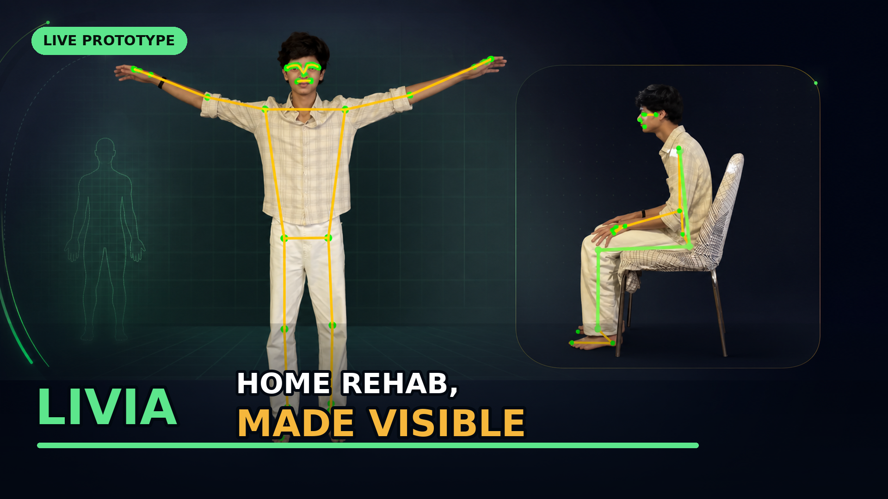
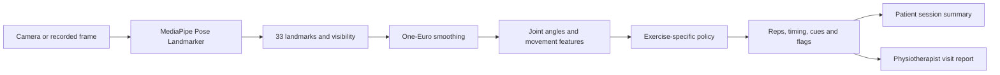
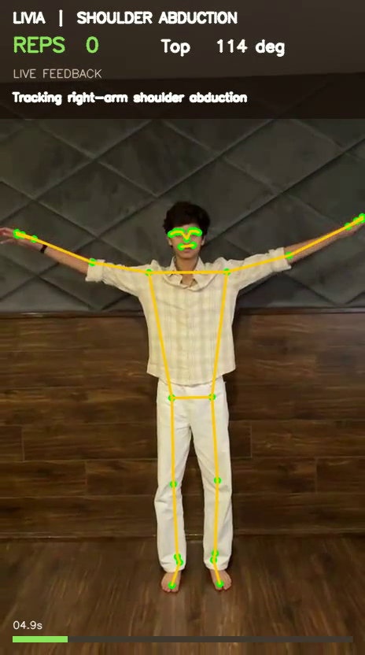
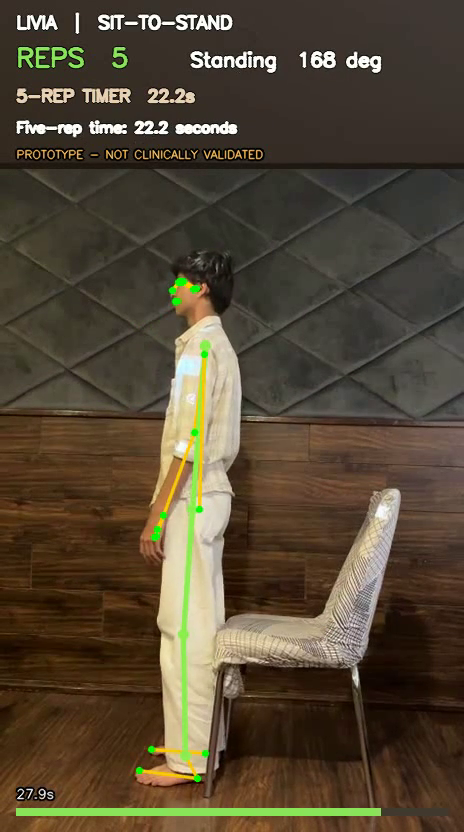
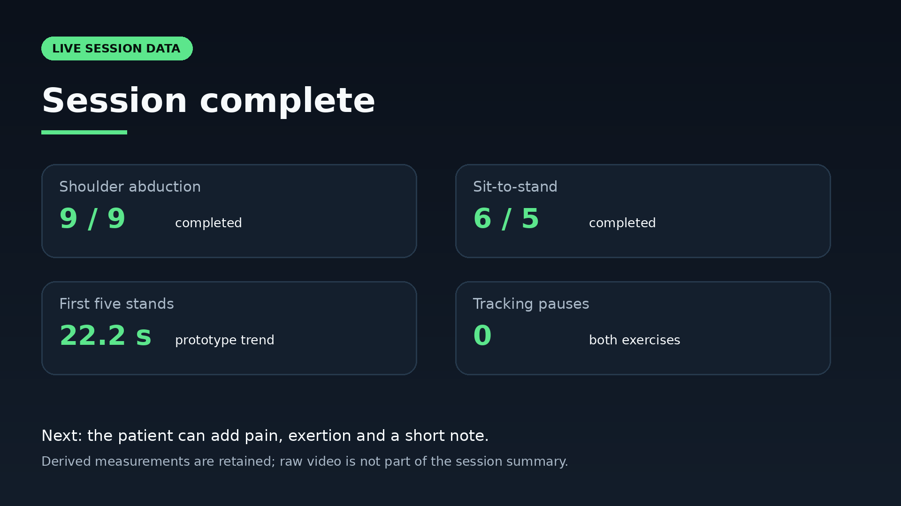
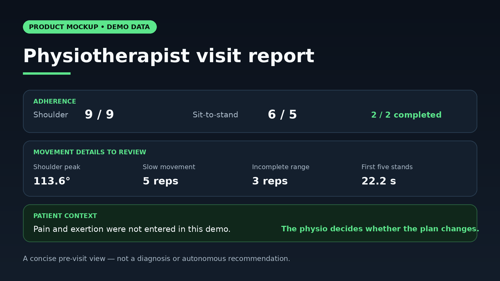

<div align="center">

# Livia

### Home rehabilitation, made visible.

Livia is a physiotherapist-configured home-exercise companion that counts
repetitions, tracks useful movement signals and turns each session into a clear
pre-visit summary.




</div>

## Pitch and demo

| Resource | Link |
| --- | --- |
| Pitch deck | [Open the Livia Pitch Deck](https://www.figma.com/slides/7v9Fi793CT6qUYgcFDIX3h/Livia-Pitch-Deck) |
| YouTube walkthrough | **Coming after upload** — `TODO: add YouTube URL` |
| Final narration | [Voiceover script](demo/hackathon-voiceover-script-v2.md) |
| Video captions | [SRT captions](demo/hackathon-voiceover-v2.srt) |
| Demo storyboard | [Walkthrough and shot list](demo/hackathon-walkthrough.md) |

> Send the YouTube URL after upload and its placeholder can be replaced directly.

## Why Livia

A physiotherapist can demonstrate an exercise during an appointment, but they
cannot watch every repetition a patient performs at home. Patients may forget
the target, rush the movement or stop early, while the clinician sees only the
result at the next visit.

Livia is designed to make that gap visible without pretending to replace the
physiotherapist. The clinician sets and changes the plan. Livia guides the
prescribed session, records bounded movement signals and prepares the context
needed for the next conversation.

## What the prototype demonstrates

- Live pose landmarks from Google's frozen MediaPipe Pose Landmarker.
- One-Euro smoothing before calculating joint angles and movement features.
- Deterministic exercise state machines rather than an opaque quality score.
- Repetition counting, timing, visibility gates and short form cues.
- A patient session summary and physiotherapist pre-visit report concept.
- A reusable pipeline that supports exercise-specific policies.

### Current exercise prototypes

| Exercise | View | Demo result | Status |
| --- | --- | --- | --- |
| Shoulder abduction | Front | 9 repetitions; 100% required-landmark visibility; no tracking pauses | Working recorded-video prototype |
| Sit-to-stand | Side | 6 repetitions; first five in 22.2 seconds; no tracking pauses | Working prototype policy; not clinically validated |

These are results from the included demonstration recordings, not clinical
accuracy claims.

## How it works



The neural network estimates pose landmarks. Exercise logic stays explicit:
thresholds, hysteresis, minimum dwell times and visibility requirements are
implemented in readable policy code. This makes each counted repetition and cue
traceable to a defined rule.

## Prototype screenshots

<table>
  <tr>
    <td align="center" width="50%">
      
      <br /><strong>Shoulder abduction</strong><br />Live angle, movement state, rep count and bounded feedback.
    </td>
    <td align="center" width="50%">
      
      <br /><strong>Sit-to-stand</strong><br />Visible-side selection, knee angle, rep count and first-five timing.
    </td>
  </tr>
  <tr>
    <td align="center" width="50%">
      
      <br /><strong>Patient session summary</strong><br />Completed reps, timing, tracking quality and a prompt for patient feedback.
    </td>
    <td align="center" width="50%">
      
      <br /><strong>Physiotherapist visit report</strong><br />Adherence, movement details to review and the patient's own context.
    </td>
  </tr>
</table>

## From home session to next visit

1. The physiotherapist selects the exercise, target repetitions and safety
   boundaries.
2. The patient follows the prescribed session in front of the camera.
3. Livia tracks only the landmarks needed for that exercise and pauses when the
   required view is unreliable.
4. The exercise policy counts complete cycles and emits bounded cues.
5. The patient can add pain, exertion, completion status and a short note.
6. The physiotherapist reviews a concise report before the next appointment and
   decides whether anything in the plan should change.

## What is working and what is still a mockup

| Capability | Current state |
| --- | --- |
| Pose inference on recorded phone video | Working |
| Shoulder-abduction counting and cues | Working prototype |
| Sit-to-stand counting and first-five timing | Working prototype; not clinically validated |
| Laptop-camera pose overlay | Working development utility |
| Patient session screen | Product mockup |
| Physiotherapist report | Product mockup |
| Android patient application | Planned; not present in this repository |
| Clinical accuracy or treatment recommendations | Not claimed |

## Run locally

### Requirements

- Python 3.11 or newer
- FFmpeg
- A webcam or MP4 recording

### Setup

```bash
git clone https://github.com/AnshulSancheti/Livia.git
cd Livia
python3 -m venv .venv
source .venv/bin/activate
pip install -r ml/requirements.txt
```

The first viewer run downloads the MediaPipe Pose Landmarker task files when
they are not already available locally.

### Watch the model on a camera

```bash
python -m ml.view --camera
```

Press `q` to quit.

### Render a sit-to-stand recording

```bash
python -m ml.render_sts input.mp4 output.mp4
```

The renderer normalises the input to 30 fps, runs the prototype policy, adds the
pose and session overlay, and preserves the source audio in the output.

### Build the hackathon walkthrough

```bash
python demo/build_walkthrough.py \
  --shoulder path/to/shoulder-demo.mp4 \
  --sts path/to/sit-to-stand-demo.mp4 \
  --output livia-walkthrough.mp4
```

## Validation approach

The repository uses a frozen pretrained pose model. It does not fine-tune
MediaPipe or train a commercial classifier on the REHAB24-6 dataset.

The dataset harness under [`ml/`](ml/) can compare pose landmarks and repetition
counts against REHAB24-6 annotations. REHAB24-6 is CC BY-NC 4.0 and is used only
as an evaluation bench. Existing benchmark artefacts are available in
[`ml/results/`](ml/results/); rerun the bench after changing exercise thresholds.

Five physiotherapists have been consulted during early idea validation. They
said this kind of between-visit visibility could be useful for clinicians and
patients. These conversations are an early signal, not a clinical study or
product-validation claim.

## Safety and privacy boundaries

- Livia is a rehabilitation companion, not an “AI physiotherapist.”
- It does not diagnose, prescribe, auto-progress treatment or replace clinical
  judgement.
- Low-confidence or missing landmarks should result in “unable to assess,” not
  a confident movement judgement.
- The product direction is to retain derived session metrics and avoid storing
  raw video by default.
- Any future flagged-clip storage would require separate, explicit consent.
- Sit-to-stand timing in this repository is a prototype trend, not a validated
  clinical Five Times Sit-to-Stand score.

## Repository map

```text
Livia/
├── demo/                       # walkthrough builder, script, captions and images
├── ml/
│   ├── pose.py                 # MediaPipe VIDEO-mode adapter
│   ├── features.py             # joint-angle and movement features
│   ├── one_euro.py             # landmark smoothing
│   ├── policy_abduction.py     # front-view shoulder policy
│   ├── policy_sts.py           # side-view sit-to-stand prototype
│   ├── render_sts.py           # annotated-video renderer
│   ├── session_fsm.py          # session and visibility state
│   └── results/                # saved evaluation snapshot
└── plans/                      # product and ML design documents
```

## Roadmap

- Android-first patient application with a live camera pipeline.
- Physiotherapist-configured prescriptions and safety thresholds.
- Local session history and post-session pain/exertion feedback.
- Shareable clinician report containing derived measurements only.
- Exercise-by-exercise validation with clinician-reviewed recordings.
- A small clinical design-partner pilot before making performance claims.

## Disclaimer

Livia is an early prototype for guidance and workflow research. It is not a
medical device, does not provide diagnosis or treatment, and has not been
clinically validated.
