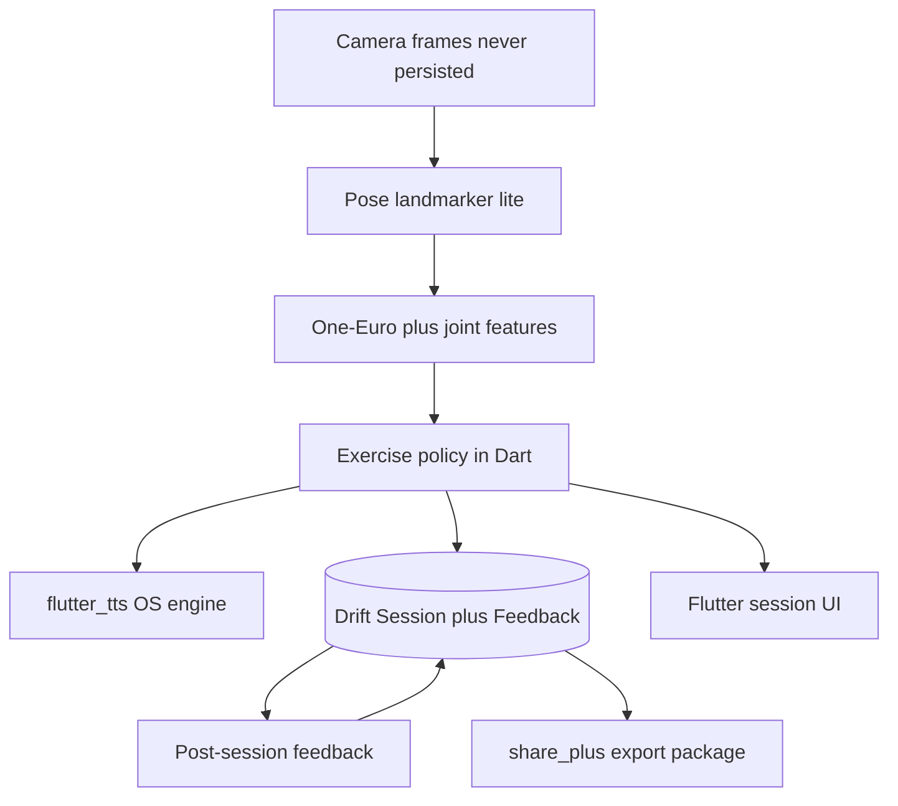

# Livia — project plan (post-hackathon)

Canonical copy lives here: [`plans/livia-project-plan.md`](livia-project-plan.md). This replaces [`RehabLoop-iQOO-Hackathon-Plan.md`](/Users/ariyan/Downloads/RehabLoop-iQOO-Hackathon-Plan.md). Do not treat the hackathon file as canonical.

The local repo at [`/Users/ariyan/Projects/Livia`](/Users/ariyan/Projects/Livia) is an empty Git shell (`origin` → [https://github.com/Hollenite/Livia](https://github.com/Hollenite/Livia), **0 commits**) plus a gitignored **5.3 GB REHAB24-6** dump under `data/`. There is no app code yet.

**Product:** Livia is a therapist-configured home-exercise companion. The phone watches a prescribed session, counts reps, flags form deviations in real time, captures patient-reported feedback, and produces an evidence package the patient can share with their clinician. It does not diagnose or change the plan.

**Decisions locked**

- Clinician path: **on-device storage + export** (share sheet). No backend in v1.
- Surfaces: **patient app only**. No clinician dashboard yet.
- Stack: **Flutter**, Android first, iOS when the exercise policy is stable. Not React Native. Not Kotlin-only.

---

## 1. Strip every hackathon constraint

Delete from the plan (do not carry into docs, architecture, or pitch):

- Red Light / Green Light, Termux-on-phone, ARM64 `aapt2` hacks, venue wifi, 8-day prep + 30-hour cut list
- iQOO 15 / SM8850 / NPU-specific Gemma builds as *requirements* (optional later as a test device, not the product)
- vivo **Office Kit**, Free Transfer, Super Clipboard, “omit INTERNET to score 25%”
- Judge slides, demo-script-as-architecture, “cut the second exercise if time is short”

**What stays (these were product, not event):** Camera → pose landmarker → filtered joint features → hysteretic rep/deviation policy → TTS cues → local session store. Calibration per exercise/view. Two starter exercises (shoulder abduction front; sit-to-stand side + 5×STS timing). No frames persisted.

**Privacy claim, rewritten:** Frames never leave RAM; no video in the DB or export. Internet permission is **allowed** later (crash reporting, optional sync) but **v1 does not need it**. The old “manifest has no INTERNET” trick is not a product strategy.

---

## 2. Do not ship a 500+ MB LLM — keep the APK small

**Drop Gemma 3 1B / LiteRT-LM entirely from v1.** Session-end prose and weekly narrative are templates over structured events, not a reason to ship ~529 MB of weights.

- `pose_landmarker_lite.task` — **~5.5 MB** — the ML model: 33 landmarks + world coords ([MediaPipe Pose Landmarker](https://developers.google.com/edge/mediapipe/solutions/vision/pose_landmarker))
- `pose_landmarker_full.task` — ~9 MB — fallback if lite is too jittery
- Optional int8 form classifier — **&lt;1 MB** — flag-gated; ship only if it earns its keep
- Gemma 3 1B int4 — **~529 MB** — **do not ship**
- OS **system TTS** (`flutter_tts`) — 0 extra APK weight — speak policy cues

Target a **single-ABI Android release (arm64-v8a) in the tens of MB**, dominated by MediaPipe native libs + the `.task` file. Do not download an LLM on first launch.

**Live coaching:** a **deterministic exercise policy** emits structured cues (`KEEP_ARM_STRAIGHT`, `DONT_SHRUG`, `CONTROL_DESCENT`, visibility pause, rep counted). A TTS adapter speaks frozen copy. No model in that path. Rate-limit cues (e.g. one spoken deviation per N seconds).

**Session / clinician narrative:** fill a frozen template from numbers already in the DB (reps completed vs prescribed, peak angles, deviation counts, 5×STS time, pain/fatigue scores). If you ever want “warmer” language, generate it **off-device** later — never inside the APK.

**Optional tiny classifier:** research-only on REHAB24-6. **Do not train a commercial model on that set** (CC BY-NC 4.0). Use the dataset to **validate** the rule engine (rep counts vs segmentation). Collect your own labeled sessions before any shipped classifier.

---

## 3. Post-session feedback (for analysis + the doctor)

Make **SessionFeedback** first-class: capture **immediately after the session** (before export), store locally, include in the clinician package.

This matches how digital home-exercise programs actually work: NRS pain/fatigue after the bout, stop reason, and adherence — not an LLM diary.

**Capture (patient, tap-first, skippable fields except pain):**

- Pain **now** (0–10 NRS); optional pain **during** worst moment
- Site (body map or short list tied to the exercise)
- Sensation: pain / stiffness / fatigue / dizziness / other
- Exertion (optional Borg/RPE 0–10)
- Completion: finished prescribed set / stopped early + **why** (pain, fatigue, time, equipment, form confusion, other)
- Free note (short)
- Auto-attached (not typed): exercise id, prescribed vs completed reps, hold times, deviation histogram, visibility pauses, 5×STS time when relevant, calibration id, app version

**Storage:** Drift (Flutter). One `Session` has many `Rep`s and one `SessionFeedback`. Nothing here is video.

**Analysis (v1, on-device):** adherence calendar, pain vs session trend, deviation frequency. Enough for the patient to show a clinician; not a data-science platform.

**Doctor path (honest limit):** export is **one-way**. The clinician reviews the file in clinic / email / WhatsApp. Their feedback to the patient is the next visit or an out-of-band message unless you later add sync. v1 does not close a two-way clinical loop.

**Export package (share sheet via `share_plus`):**

- `session.json` — machine-readable (prescription snapshot, reps, deviations, feedback)
- `session.html` or PDF — human-readable for the doctor
- `checksum` / generated-at / app version

No landmark dumps in v1 (re-identifiable motion). Derived scalars only.

---

## 4. Architecture

**Deep modules (small interfaces, heavy implementation):**

- **Pose adapter** — `Frame → PoseObservation` (33 2D + world landmarks, visibilities). Only place that knows MediaPipe. Native plugin on Android (CameraX + Tasks Vision LIVE_STREAM, GPU delegate); iOS later with the same Dart interface.
- **Feature extractor** — `PoseObservation → FeatureVector` (angles, normalised distances, velocities). Pure Dart. Same formulae in a Python harness for REHAB24-6 validation.
- **Exercise policy** — `FeatureVector + Prescription → {rep events, deviations, coaching cues, hard-stop}`. Pure Dart. No TTS, no DB, no camera. This is the product.
- **Session store** — Drift: sessions, reps, calibration, feedback.
- **Exporter** — `SessionId → files + share`.
- **TTS adapter** — `CoachingCue → speech` via `flutter_tts`.

Hard-stop on therapist pain threshold stays **in the policy**, before any summary UI.

Regulatory framing stays: monitoring / decision-support prototype, no diagnosis, no autonomous plan change ([CDSCO software guidance](https://cdsco.gov.in/opencms/export/sites/CDSCO_WEB/Pdf-documents/Guidance-document-on-Medical-Device-Software-under-MDR-2017.pdf)).

---

## 5. Flutter stack (locked)

Official Pose Landmarker is Android (Kotlin/Java) and iOS (Swift) only. Flutter wraps those APIs; that is acceptable if the **pose adapter is a thin native seam** and all product logic stays in Dart.

**App**

- Flutter patient app, **Android first** (arm64-v8a), iOS when the policy is stable
- Bundled `pose_landmarker_lite.task` in assets (~5.5 MB); swap to `full` only if lite fails fps/jitter gates
- Camera + inference on the native side (LIVE_STREAM, GPU delegate, `numPoses = 1`). Do not use RN-style ~15 fps throttling. Gate: **≥24 fps** sustained on a mid-range Android phone in release mode (debug FPS is not evidence)

**Dart (single implementation of the product)**

- Feature extractor, One-Euro filter, both exercise state machines, deviation rules, coaching cue IDs
- Drift for local DB
- `flutter_tts` for cues
- `share_plus` for the clinician package

**Do not** duplicate joint-angle maths in Kotlin *and* Dart. Native code converts frames to `PoseObservation` only. A Python harness mirrors the Dart formulae for dataset validation.

**Rejected:** React Native (Vision Camera / New Architecture wrappers; several packages iOS-ahead or fps-throttled). Kotlin-only app (you chose Flutter). On-device LLM.

**Suggested package layout (when we build, not now):**

- `lib/pose/` — adapter interface + MediaPipe plugin wiring
- `lib/features/` — extractor + One-Euro
- `lib/policy/` — prescriptions, state machines, cues, hard-stop
- `lib/session/` — Drift schema + repositories
- `lib/feedback/` — post-session UI + `SessionFeedback`
- `lib/export/` — JSON + HTML/PDF + share
- `tool/` or `scripts/` — Python validation over REHAB24-6 (reads `data/`, never committed)

---

## 6. Data model (v1)

- `Prescription` — therapist-configured (entered on-device for now): exercise, target reps, hold, schedule, pain stop threshold, view (front/side)
- `Calibration` — ROM baseline, torso pixel height band, view confirmation
- `Session` — start/end, abort reason
- `Rep` — index, duration, peak angle, hold, deviation list
- `SessionFeedback` — the post-session PROM block above

Still **no frames, no video, no raw landmark time-series** in v1.

---

## 7. Exercises (unchanged clinically)

**One camera view per exercise.** Only deviations observable from that view.

### A. Shoulder abduction — front view

- Landmarks: 11/12 shoulders, 13/14 elbows, 15/16 wrists, 23/24 hips, 7/8 ears
- Primary metric: abduction angle = torso vector (shoulder→hip) vs upper-arm (shoulder→elbow)
- Rep SM with hysteresis: `BOTTOM (<20°) → ASCENT → TOP (≥ target, held holdMs) → DESCENT → BOTTOM`
- Bent elbow: elbow angle &lt; 160° → cue keep arm straight
- Shoulder hike: ear-to-shoulder distance drops &gt;15% vs calibrated baseline → cue don’t shrug

### B. Sit-to-stand — side view

- Landmarks: camera-side hip/knee/ankle/shoulder
- Knee angle: seated ≈ 90°, standing ≈ 170°
- Excessive trunk flexion at lift-off; uncontrolled descent (&lt; 0.5s lowering)
- Time five consecutive reps → **Five Times Sit-to-Stand** as a trending number

**Signal quality (non-negotiable):** One-Euro on landmarks before angles; hysteresis + min dwell; visibility gate (pause counting if required landmarks drop); calibration screen that records *this patient’s* ROM, not textbook angles.

---

## 8. Repo (when leaving plan-only mode — not this step)

[https://github.com/Hollenite/Livia](https://github.com/Hollenite/Livia) is the remote; local has **no commits**. Later:

- `CONTEXT.md` — glossary only (Session, Prescription, Deviation, SessionFeedback, ExportPackage)
- `docs/adr/` — (1) no on-device LLM, (2) local-export not cloud, (3) Flutter
- `README.md` — product + how to run
- Do not commit `data/` (already gitignored)
- Keep REHAB24-6 local for validation scripts only

---

## 9. Build sequence (not a 30-hour sprint)

1. Flutter Android app: camera + pose overlay + lite model, release-mode fps gate
2. Dart policy + TTS for **shoulder abduction**
3. Drift persistence
4. Post-session feedback screen
5. Share-sheet export (JSON + HTML/PDF)
6. Sit-to-stand + 5×STS
7. Python harness vs REHAB24-6 segmentation (rep-count accuracy number)

Offline-capable because home rehab often has bad connectivity; export is the clinic handoff — not because a hackathon scored “no internet.”

Not a doctor portal. Analysis in v1 is local trends + a file a human can open.
